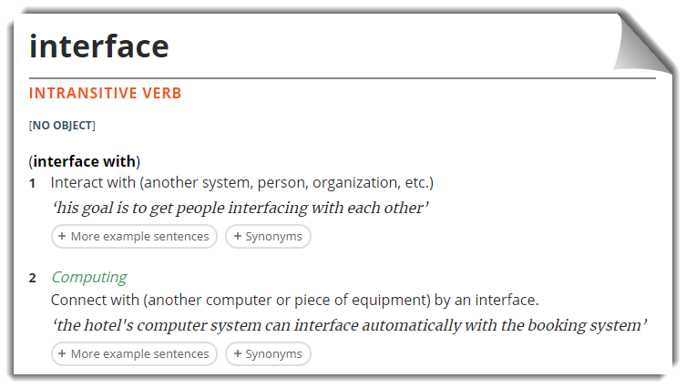

<style>
section { justify-content: flex-start; }
</style>

# Interfaces

[](https://www.lexico.com/en/definition/interface)

Describes signatures

- Properties
- Methods

<!--
> **Dependency Inversion Principle**
>
> - Depend on abstractions, not on concretions

TODO:

- Interfaces in .Net Core
-->

----

# Interface Example - `IAdjustSpeed`

```csharp
public interface IAdjustSpeed
{
    void Accelerate(double rate, TimeSpan duration);
    void Decelerate(double rate, TimeSpan duration);
    double CurrentSpeed { get; }
}
```

----

# Interface Example - `IAdjustSpeed`

```csharp
public class Treadmill : IAdjustSpeed
{
    public void Accelerate(double rate, TimeSpan duration)
    {
        // Implementation body
    }

    public void Decelerate(double rate, TimeSpan duration)
    {
        // Implementation body
    }

    public double CurrentSpeed { get; private set; }
}
```

----

# Interface Example - `IAdjustSpeed`

```csharp
public class Car : IAdjustSpeed
{
    public void Accelerate(double rate, TimeSpan duration)
    {
        // Implementation body
    }

    public void Decelerate(double rate, TimeSpan duration)
    {
        // Implementation body
    }

    public double CurrentSpeed { get; set; }
}
```

----

# Interface Example - `IAdjustSpeed`

```csharp
public class Elevator : IAdjustSpeed
{
    public void Accelerate(double rate, TimeSpan duration)
    {
        // Implementation body
    }

    public void Decelerate(double rate, TimeSpan duration)
    {
        // Implementation body
    }

    public double CurrentSpeed { get; set; }
}
```

----

# Interface Example - `IAdjustSpeed`

```csharp
public class ControlPanel
{
    private IAdjustSpeed _ControlledItem;
    public ControlPanel(IAdjustSpeed obj)
    {
        _ControlledItem = obj;
    }

    public void HandleKeypress(char key)
    {
        switch(key)
        {
            case "w":
                _ControlledItem.Accelerate(boostRate, new TimeSpan(0, 0, 5));
                break;
            // ...
        }
    }
}
```

----

# Interface Example - `ILocatable` `IPingable`

> Adapted from an old text-based *Star Trek* game
> 
```csharp
public interface ILocatable
{
    Location QuadrantPosition { get; }
    Location SectorPosition { get; }
    Quadrant Quadrant { get; }
    Sector Sector { get; }
}
```

```csharp
public interface IPingable
{
    string Ping();
}
```

----

# Interface Implementation Example

```csharp
public class Star : AbstractLocatable
{
    public string ping() {
        return " * ";
    }
}
```

```csharp
public class Space : IPingable
{
    public string ping() {
        return "  ";
    }
}
```

----

<!-- _backgroundColor: #222 -->

# The End

