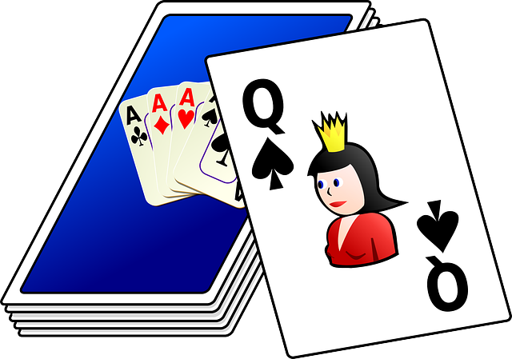
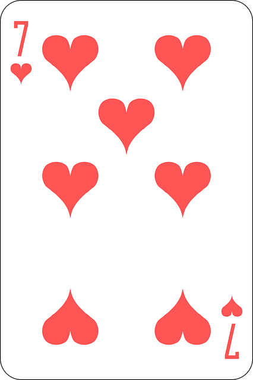
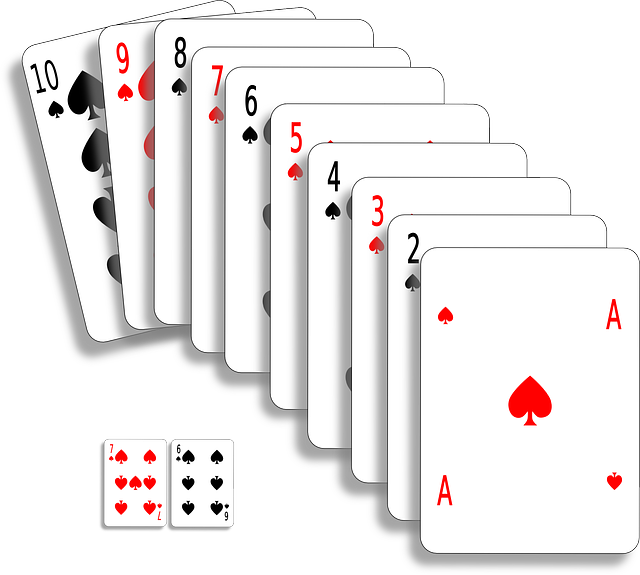

# Playing Cards and Decks



* Using xUnit
* Using Fluent Assertions

----

# Initial Design

- Standard deck of 52 playing cards (without the Wild Cards)
- Simple functionality with the deck
  - The deck comes pre-sorted when created
  - We can shuffle the deck
  - We can draw a single card from the deck

----

# `PlayingCard` Specifications



----

# `PlayingCard` Specifications

```csharp
public class A_Playing_Card_Must
{

}
```

* **Readability** - Underscores between the word parts of class name
  * Specification names are descriptive, and can get longer than normal class names
  * The name of the class reads like an opening phrase
    * This is like a "prefix" for the names of the test methods
 
----

# `PlayingCard` Specifications

* A field for a playing card instance that we are designing

```csharp
public class A_Playing_Card_Must
{
    PlayingCard playingCard = new PlayingCard(FIVE, HEARTS);
}
```

* Playing Cards are ***value types*** - they have no real behaviour

```csharp
public struct PlayingCard
{
}
```

----

# `PlayingCard` Specifications

###### ***A_Playing_Card_Must***...

```csharp
[Fact]
public void Track_Supplied_Suit()
{
    playingCard.Suit.Should().Be(HEARTS);
}
```

----

# `PlayingCard` Specifications

###### ***A_Playing_Card_Must***...

```csharp
[Fact]
public void Track_Supplied_Value()
{
    playingCard.Value.Should().Be(FIVE);
}
```

----

# `PlayingCard` Specifications

###### ***A_Playing_Card_Must***...

```csharp
[Fact]
public void Express_As_Meaningful_String()
{
    playingCard.ToString().Should().Be("Five of Hearts");
}
```

----

# `PlayingCard` Specifications

###### ***A_Playing_Card_Must***...

```csharp
[Fact]
public void Contain_Full_Range_Of_Card_Suits()
{
    var range = new string[] { "HEARTS", "DIAMONDS", "SPADES", "CLUBS" };
    var CardSuitNames = Enum.GetNames(typeof(PlayingCard.CardSuit));
    CardSuitNames.Should().Contain(range);
}
```

----

# `PlayingCard` Specifications

###### ***A_Playing_Card_Must***...

```csharp
[Fact]
public void Contain_Full_Range_Of_Card_Values()
{
    var range = new string[] { "ACE", "TWO", "THREE", "FOUR", "FIVE",
                               "SIX", "SEVEN", "EIGHT", "NINE", "TEN",
                               "JACK", "QUEEN", "KING" };
    var CardValueNames = Enum.GetNames(typeof(PlayingCard.CardValue));
    CardValueNames.Should().Contain(range);
}
```

----

# `Deck` Specifications



```csharp
public class A_Deck_Of_Cards_Must
{
    DeckOfCards deck = 
        DeckOfCards.OpenNewDeck();
}
```

```csharp
public class DeckOfCards
{
    public static DeckOfCards OpenNewDeck()
        => new DeckOfCards();
}
```

----

# `Deck` Specifications

###### ***A_Deck_Of_Cards_Must***...

```csharp
[Fact]
public void Open_With_52_Cards()
{
    deck.Count.Should().Be(52);
}
```

----

# `Deck` Specifications

###### ***A_Deck_Of_Cards_Must***...

```csharp
[Fact]
public void Not_Be_Empty_When_Opened()
{
    deck.IsEmpty.Should().BeFalse();
}
```

----

# `Deck` Specifications

###### ***A_Deck_Of_Cards_Must***...

```csharp
[Fact]
public void Not_Have_Duplicate_Cards()
{
    var cards = deck.Cards;
    cards.Should().OnlyHaveUniqueItems();
}
```

----

# `Deck` Specifications

###### ***A_Deck_Of_Cards_Must***...

```csharp
[Fact]
public void Open_With_Cards_In_Order()
{
    var cards = deck.Cards;
    cards.Should().BeInAscendingOrder();
}
```

----

# `Deck` Specifications

###### ***A_Deck_Of_Cards_Must***...

```csharp
[Fact]
public void Shuffle_Cards_Into_A_Random_Order()
{
    deck.Shuffle();
    var cards = deck.Cards;
    cards.Should().NotBeInAscendingOrder();
}
```

----

# `Deck` Specifications

###### ***A_Deck_Of_Cards_Must***...

```csharp
[Fact]
public void Draw_The_Top_Card_From_The_Deck()
{
    var expectedCard =
        new PlayingCard(PlayingCard.CardValue.ACE, PlayingCard.CardSuit.HEARTS);
    var card = deck.DrawCard();
    card.Should().NotBeNull().And.Be(expectedCard);
}
```

----

# `Deck` Specifications

###### ***A_Deck_Of_Cards_Must***...

```csharp
[Fact]
public void Remove_The_Card_From_The_Deck_When_Drawn()
{
    var expectedCard =
        new PlayingCard(PlayingCard.CardValue.ACE, PlayingCard.CardSuit.HEARTS);
    deck.DrawCard();
    deck.Cards.Should().NotContain(expectedCard);
}
```


----

<!-- _backgroundColor: #222 -->

# The End

