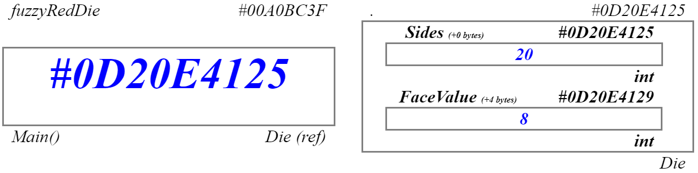

<style scoped>
section {
  padding-left: 60%;
  justify-content: center;
}
</style>


# **C# Programming**

## Foundational Concepts for Objects

----

<style>
section { justify-content: flex-start; }
</style>

# What is a Computer Program?

> ## *A computer program is a **set of instructions** for manipulating **information**.*

* ## **Information** is central to computer programs
* ## Computer programs use **Instructions** to *manipulate* information

----

# Variables, Values and Data Types


- ## A **Value** is a piece of *information*
- ## A **Variable** is an *identifier* for a piece of information
  - ### Think of it as a "container"
- ## A **Data Type** *describes* information
  - ### How much *memory* to use
  - ### How to *interpret* the bits/bytes in memory

----

<style scoped>
img {
  display: block;
  margin: 0 auto;
}
h4 {
  overflow: hidden;
  white-space: nowrap;
  margin: 0 25px;
}
h4 em {
  border: solid thin gray;
  display: inline-block;
  margin: 2px 1px;
}
</style>

# Visualizing Data in Memory

### Data in memory is **binary** (*1's and 0's*)

#### **010101000101010010100111110*1000110101011001*01110101011100010101011010101101010010110101101**

### A **variable** refers to a *block* of memory. Imagine that block as a box. 


----

# **Value Type** *vs.* **Reference Type**

## A **Value Type** stores its value at the memory address directly associated with the variable name.


```csharp
int answer = 42; 
```

----

# **Value Type** *vs.* **Reference Type**

## A **Reference Type** stores the memory address of where the value is stored.


```csharp
string name = "Stew Dent";
```

----

# Reference Types - *`null`*

## `null` refers to memory address zero *(which doesn't exist)*

```csharp
Die fuzzyRedDie = null;
```


----

# Reference Types - *Instance*

## `new` instantiates an object based on the data type 

```csharp
fuzzyRedDie = new Die(20);
```



----

# Rules for Variables/Values/Data Types

### The following rules are applied to all variables, values and data types.

- Any value stored in a variable must be of the same data type as the variable.
- Variables must be declared before they can be used.
- A variable's data type can only be declared once.
- Each variable can only hold one value at a given time.
- Each variable must have a distinct name.

----


<!--
_backgroundColor: #1111
_color: black
-->

# The End