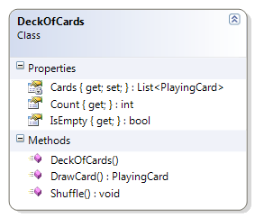

# Class

> A blueprint for creating objects

```csharp
public class Car
{
    public string Color { get; private set; }
    // more members ...
    
    public Car(string vin, string make, string model, string color)
    {
        // Set initial state of car
    }

    public void Repaint(string color)
    {
        Color = color;
    }
    // more members ...
}
```

----


# Object

> An **instance** of a class

```csharp
new Car("1234", "P120", "Audi", "green")
```

---


# Die Class

```csharp
public class Die
{
    private static Random rnd = new Random();
    public int Sides { get; private set; }

    public Die() : this(6) { }

    public Die(int sides)
    {
        if (sides < 4 || sides > 20)
            throw new System.Exception("A die can only have from 4 to 20 sides");
        this.Sides = sides;
        Roll();
    }

    public int FaceValue { get; private set; }

    public void Roll()
    {
        FaceValue = rnd.Next(1, Sides + 1);
    }
}
```

---


# Fraction Class (1 of 3)
### Properties + Constructor

```csharp
    public int Numerator { get; private set; }

    public int Denominator { get; private set; }

    public Fraction(int numerator, int denominator)
    {
        Numerator = numerator;
        Denominator = denominator;
    }

    public Fraction Reciprocal
    {
        get { return new Fraction(Denominator, Numerator); }
    }
```

---


# Fraction Class (2 of 3)
### Methods

```csharp
    public override string ToString()
    {
        string stringValue = "";
        stringValue += Numerator + "/" + Denominator;
        return stringValue;
    }

    public double ToDouble()
    {
        // The casting of numerator to a double helps
        // ensure that we don't lose any fractional
        // portion due to integer division.
        double value = (double)(Numerator) / Denominator;
        return value;
    }
```

---


# Fraction Class (3 of 3)
### Enhancements

* `void FixSign()` - Ensures any negative sign appears only on the numerator
* `public bool IsProperFraction` - Returns `true` if it's a proper fraction
* Implement the `*` and `/` Operators
* Implement the `+` and `-` Operators

---


# Angle Class (1 of 3)

```csharp
public class Angle
{
    public Angle(double degrees)
    {
        this.Degrees = degrees;
    }

    public double Degrees { get; set; }

    // http://unicode.org/notes/tn28/UTN28-PlainTextMath.pdf
    // Page 40 of the above reference for the degree symbol
    public override string ToString()
    {
        return Degrees.ToString() + '\u00B0';
    }
}
```

---


# Angle Class (2 of 3)

```csharp
public double Radians
{
    get
    {
        double radians = Degrees * (Math.PI / 180);
        return radians;
    }
}

public double Grads
{
    get
    {
        double grads = Radians * (200 / Math.PI);
        return grads;
    }
}
```

---


# Angle Class (3 of 3) - `public string AngleType {...}`

Angle Range     | Angle Type
----------------|-----------
< = 0 or > 360  | Undefined
> 0 and < 90    | Acute
= 90            | Right
> 90 and < 180  | Obtuse
= 180           | Straight
> 180 and < 360 | Reflex
= 360           | Full Rotation

---


# Composition

| DeckOfCards | PlayingCard | CardSuit | CardValue |
|---|---|---|---|
|  |  |  |  |

---


# Class

```csharp

```

---


# Class

```csharp

```

----

- [ ] Emphasize instance (non-static) class members and instantiating objects