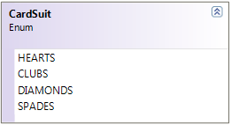
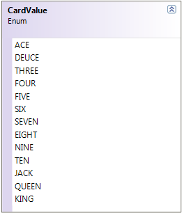

# Class

> A blueprint for creating objects

```csharp
public class Car
{
    public string Color { get; private set; }
    // more members ...
    
    public Car(string vin, string make, string model, string color)
    {
        // Set initial state of car
    }

    public void Repaint(string color)
    {
        Color = color;
    }
    // more members ...
}
```

----


# Object

> An **instance** of a class

```csharp
new Car("1234", "P120", "Audi", "green")
```

---


# Die Class

```csharp
public class Die
{
    private static Random rnd = new Random();
    public int Sides { get; private set; }

    public Die() : this(6) { }

    public Die(int sides)
    {
        if (sides < 4 || sides > 20)
            throw new System.Exception("A die can only have from 4 to 20 sides");
        this.Sides = sides;
        Roll();
    }

    public int FaceValue { get; private set; }

    public void Roll()
    {
        FaceValue = rnd.Next(1, Sides + 1);
    }
}
```

---


# Fraction Class (1 of 3)
### Properties + Constructor

```csharp
    public int Numerator { get; private set; }

    public int Denominator { get; private set; }

    public Fraction(int numerator, int denominator)
    {
        Numerator = numerator;
        Denominator = denominator;
    }

    public Fraction Reciprocal
    {
        get { return new Fraction(Denominator, Numerator); }
    }
```

---


# Fraction Class (2 of 3)
### Methods

```csharp
    public override string ToString()
    {
        string stringValue = "";
        stringValue += Numerator + "/" + Denominator;
        return stringValue;
    }

    public double ToDouble()
    {
        // The casting of numerator to a double helps
        // ensure that we don't lose any fractional
        // portion due to integer division.
        double value = (double)(Numerator) / Denominator;
        return value;
    }
```

---


# Fraction Class (3 of 3)
### Enhancements

* `void FixSign()` - Ensures any negative sign appears only on the numerator
* `public bool IsProperFraction` - Returns `true` if it's a proper fraction
* Implement the `*` and `/` Operators
* Implement the `+` and `-` Operators

---


# Angle Class (1 of 3)

```csharp
public class Angle
{
    public Angle(double degrees)
    {
        this.Degrees = degrees;
    }

    public double Degrees { get; set; }

    // http://unicode.org/notes/tn28/UTN28-PlainTextMath.pdf
    // Page 40 of the above reference for the degree symbol
    public override string ToString()
    {
        return Degrees.ToString() + '\u00B0';
    }
}
```

---


# Angle Class (2 of 3)

```csharp
public double Radians
{
    get
    {
        double radians = Degrees * (Math.PI / 180);
        return radians;
    }
}

public double Grads
{
    get
    {
        double grads = Radians * (200 / Math.PI);
        return grads;
    }
}
```

---


# Angle Class (3 of 3) - `public string AngleType {...}`

Angle Range     | Angle Type
----------------|-----------
< = 0 or > 360  | Undefined
> 0 and < 90    | Acute
= 90            | Right
> 90 and < 180  | Obtuse
= 180           | Straight
> 180 and < 360 | Reflex
= 360           | Full Rotation

---


# Composition

| DeckOfCards | PlayingCard | CardSuit | CardValue |
|---|---|---|---|
|  |  |  |  |

---


# PlayingCard

<style scoped>
    section {
        display: grid;
        grid-template-columns: 3fr 1fr;
        grid-gap: 10px;
    }
    h1 { grid-column: 1 / 3 }
    img { grid-column: 2 }
</style>

```csharp
public class PlayingCard
{
    public CardSuit Suit { get; private set; }
    public CardValue Value { get; private set; }
    public PlayingCard(CardValue value, CardSuit suit)
    {
        Value = value;
        Suit = suit;
    }
    public override string ToString()
    {
        return $"{Value} {Suit}s";
    }
}
```


---


# Enums (Inside `PlayingCard`)

<style scoped>
    section {
        display: grid;
        grid-template-columns: repeat(4, 1fr);
        grid-gap: 10px;
    }
    h1 { grid-column: 1 / 5 }
</style>


```csharp
public enum CardSuit
{
    HEARTS = 1,
    CLUBS,
    DIAMONDS,
    SPADES
}
```

```csharp
public enum CardValue
{
    ACE = 1,
    DEUCE,
    THREE,
    FOUR,
    FIVE,
    SIX,
    SEVEN,
    EIGHT,
    NINE,
    TEN,
    JACK,
    QUEEN,
    KING
}
```


----


# Deck *(Properties/Constructor)*

<style scoped>
    section {
        display: grid;
        grid-template-columns: 3fr 1fr;
        grid-gap: 10px;
    }
    h1 { grid-column: 1 / 3 }
    img { grid-column: 2 }
</style>

```csharp
public class DeckOfCards
{
    public List<PlayingCard> Cards { get; private set; }
    public int Count => Cards.Count;
    public bool IsEmpty => Cards.Count == 0
    public DeckOfCards()
    {
        Cards = new List<PlayingCard>();
        var allSuits = System.Enum.GetValues(typeof(PlayingCard.CardSuit));
        var allValues = System.Enum.GetValues(typeof(PlayingCard.CardValue));
        foreach (PlayingCard.CardSuit suit in allSuits)
            foreach (PlayingCard.CardValue value in allValues)
                Cards.Add(new PlayingCard(value, suit));
    }
}
```


----


# Deck *(Methods)*

<style scoped>
    section {
        display: grid;
        grid-template-columns: 3fr 1fr;
        grid-gap: 10px;
    }
    h1 { grid-column: 1 / 3 }
    img { grid-column: 2 }
</style>

```csharp
public class DeckOfCards
{
    public PlayingCard DrawCard()
    {
        PlayingCard card = null;
        if (Cards.Count != 0)
        {
            card = Cards[0];
            Cards.Remove(card);
        }
        return card;
    }
    public void Shuffle()
    {
        for (int counter = 0; counter < 100; counter++)
        {
            int index = Rnd.Next(Cards.Count);
            PlayingCard card = Cards[0];
            Cards.RemoveAt(0);
            Cards.Insert(index, card);
        }
    }
}
```


----


# Using `DeckOfCards` etc.

* Create the game of **Go Fish** with the following classes
  * Player
  * Game

----


# Improving `DeckOfCards`

* Add a method to deal: `List<PlayingCard> Deal(int count)`
* Add another constructor to take in the number of decks to bundle together
  * Create a driver for the card game of **War**

----

<!-- _backgroundColor: #222 -->

# The End