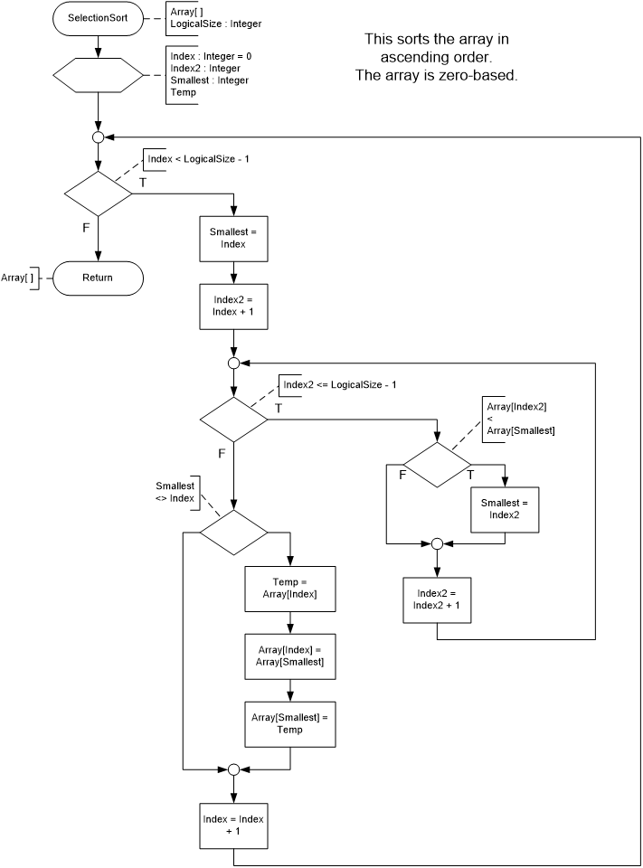
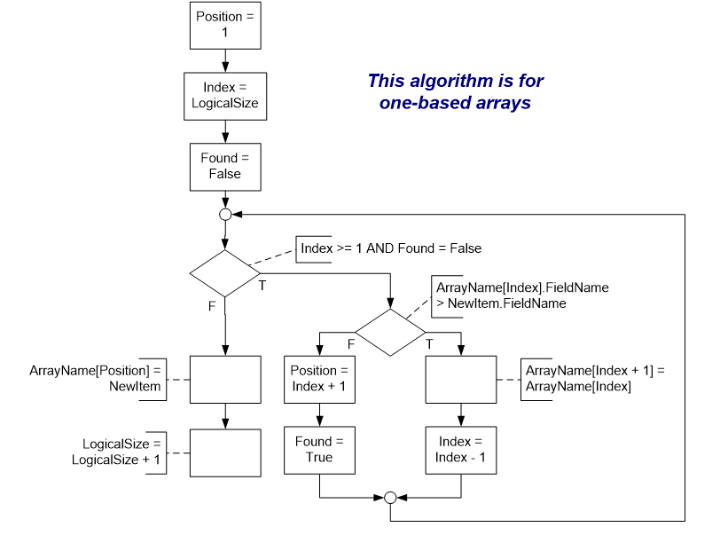
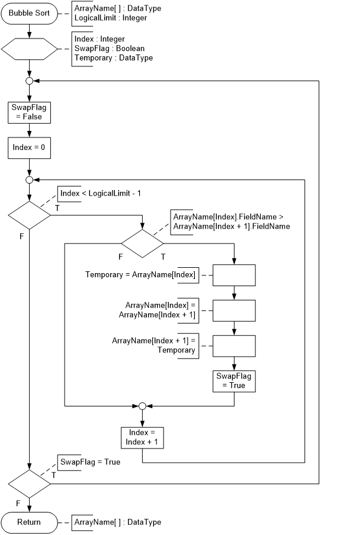
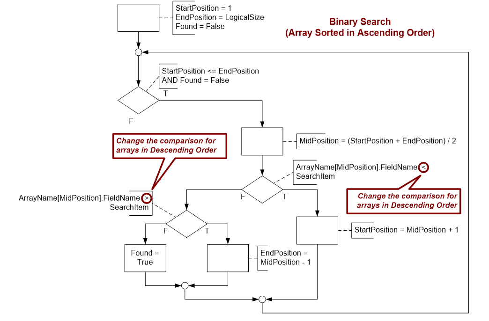
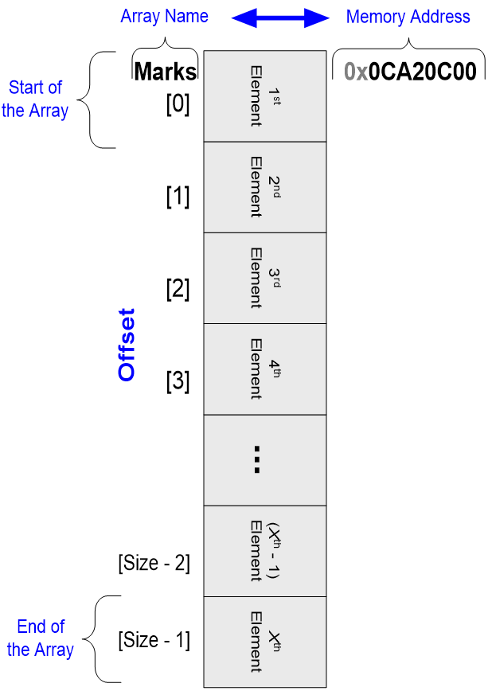
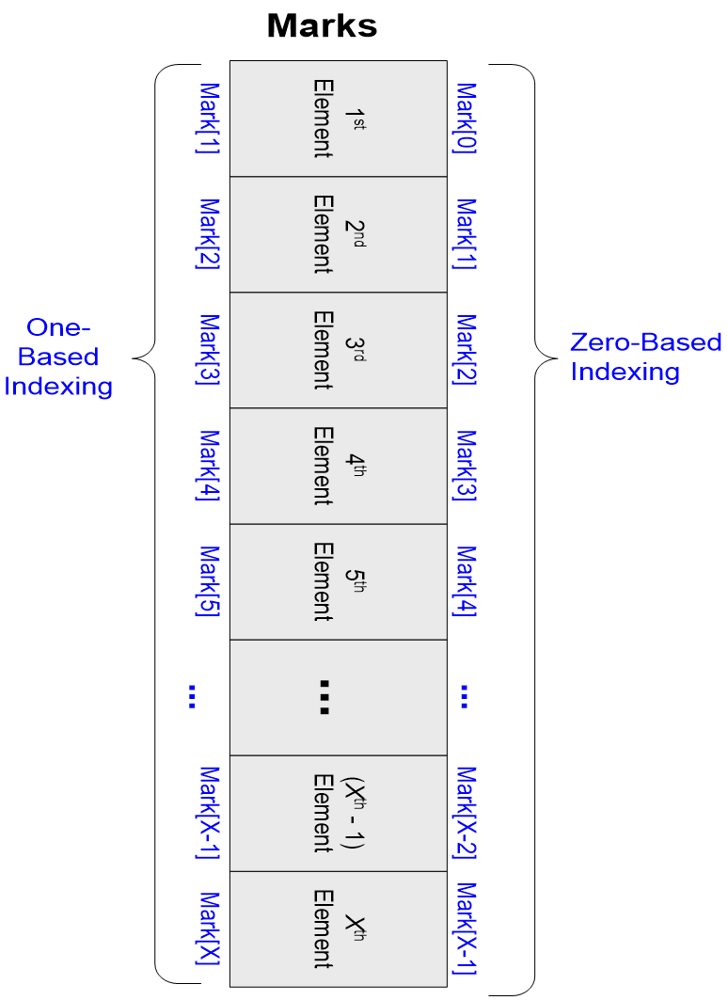

<style>
section { justify-content: flex-start; }
</style>

# Arrays

----

# What is an Array?

* An **Array** is a
  * Series of distinct values ("Elements")
  * Stored contiguously in memory
* An **Element** is an
  * Individual item in the array
  * Distinguished by combining the array name with an index/subscript
    * `arrayName[index]`
* An **Index/Subscript** is an
  * Integer used to indicate the position of an element in an array

----

# What is an Array?

* The **Physical Size** of an array refers to
  * The number of elements in the array
  * Can be as small as zero elements
  * Can be as large as the maximum value for an integer
* The **Logical Size** of an array refers to
  * The number of elements in the array that are "actually" being used
  * Cannot be less than zero
  * Maximum value is the number of elements in the array
* The **Memory Allocated** for an array is
  * The product of the size of each element times the number of elements

----

<style scoped>
    tr, th, tr td:nth-child(2) {
        border: 0;
    }
    tr,tr:nth-child(2n) {
                background-color: transparent;
    }
    td:nth-child(1) {
        background-color: lightgray;
        border-color: black;
    }
    th:nth-child(2), td:nth-child(2) {
        font-size: .85em;
        color: gray;
    }
    section {
        display: grid;
        grid-template-columns: repeat(2, 1fr);
        grid-gap: 5px;
    }
    table {
        grid-column: 2;
        grid-row: 2 / 8;
    }
    section h1:nth-child(1) {
        grid-row: 1;
        grid-column: 1 / 3;
    }
</style>

# Arrays in Computer Memory

* Arrays are Reference Types
  * The array "refers to" a memory address where the values are stored
* Each element in the array is the same data type
  * Size of each item (in bytes) is fixed
  * Address of individual elements is calculated:
    * Starting Address + (elementSize * indexOffset)


| `ArrayName` | *0x***0CA20C00** |
|:------:|:----|
| *1st Element* | `ArrayName[0]` |
| *2nd Element* | `ArrayName[1]` |
| *3rd Element* | `ArrayName[2]` |
| *4th Element* | `ArrayName[3]` |
| *5th Element* | `ArrayName[4]` |
| [...]  | |
| *n Element* | `ArrayName[*n-1*]` |


----

# Types of Arrays

- 1D Arrays
- Corresponding Arrays
- Multifunctional Arrays
- Multidimensional Arrays
- Multifunctional Multidimensional Arrays
- Jagged Arrays
- Arrays where the Index has a meaning (beyond identifying the position of the element)

----

# Array Processing

- Array processing is typically done using looping logic
  - Sequential access
  - Non-sequential access (efficiency algorithms)
  - "Random access" (where the index has a meaning)
- Typical array processing includes
  - Initializing / Loading
  - Modifying Elements
  - Searching
  - Aggregation (totaling, counting, etc.)
  - Sorting
  - Inserting / Deleting Elements


----

<!-- _backgroundColor: #222 -->

# The End

----

<!-- _backgroundColor: #222 -->

# **Archived Material** Follows Here

----

# Approaches to Sorting

- There are numerous distinct types of sorting algorithms (~37):
  - Sequential, Insertion, Bubble, Shell, Heap, Merge, Swap, Radix, Quick, etc.
- Animation Demo of various Sorts:
  - http://www.cs.ubc.ca/spider/harrison/Java/sorting-demo.html
  - (Other algorithm animations can be found at http://www.cs.hope.edu/~alganim/ccaa/)

----

# Swapping

- Core part of many sorting algorithms
- Swapping is where the values in two different locations (elements) are exchanged
- Requires a third variable

```csharp
Temporary = VariableA

VariableA = VariableB

VariableB = Temporary
```

----

# Selection Sort

- Follows this pattern:
  1. Sequentially search all the elements to find the smallest (lowest value)
  1. Swap the smallest element with the first element
  1. Find the smallest of the remaining elements
  1. Swap it with the second element
  1. Repeat the pattern until only two elements remain in the list
- Performance – O(n2)
- http://www.lcusd.net/lchs/dclausen/apcs_cpp/ch_8_selection_sort.htm

----

# Selection Sort



----

# Insertion Sort

- Uses the algorithm for inserting into a sorted array
  - Find the location and move all the elements below that location down one position to make room for the new element
- Requires two arrays
  - The unsorted (original) array
  - A new array (used as the destination for the insertion sort)
- Performance – O(n2)

----



# Inserting - Sorted Arrays

- Elements are moved down to make room for the item that is to be inserted
- Does require a looping structure
- Processing typically begins at the end of the array and moves up to the start of the array (efficiency)

----

# Bubble Sort

- Follows this pattern:
  1. Compare adjacent elements
  1. Swap the adjacent elements if they are not in order
  1. Swapping each pair causes smallest element to “bubble” to the top (largest element quickly sinks to the bottom)
  1. Repeat the pattern until no elements are swapped on a complete pass through the array
- Performance – O(n2)

----

# Bubble Sort



----


# Converting Decimal to Hexadecimal

- Divide the number by the base and find the remainder of the division
- Divide the non-remainder portion (of the last calculation) by the base and find the remainder of this division
- Repeat until you have divided 0 (zero) by the base to find the final remainder

----

# Quick Sort

- Works as follows:
  - Start with the entire array as a single partition
  - Split the array into two parts (partitions)
    - Pick a single element
    - Compare each item to the chosen element
    - Put items that are greater in the right partition
    - Put items that are less in the left partition
  - Sort the parts independently by repeating the partitioning process recursively
- Performance
  - Average – O(n log n)
  - Worst Case – O(n2/2)

----

# Binary Search



----




<!--
- An array is 
  - a Contiguous ([next or together in sequence](https://www.lexico.com/en/definition/contiguous)) set of values where
  - each element in the array is of the same "size" (Type)
- An array variable points to the **start** of the array
- An array with an **index** points to an **element** in the array
  - The *index* is an **offset** from the start of the array
- Arrays use a **zero-based index** to make the math simpler
- Arrays are **fixed** in size
- Single-dimension
- Two-Dimension
- Multi-Dimension
-->